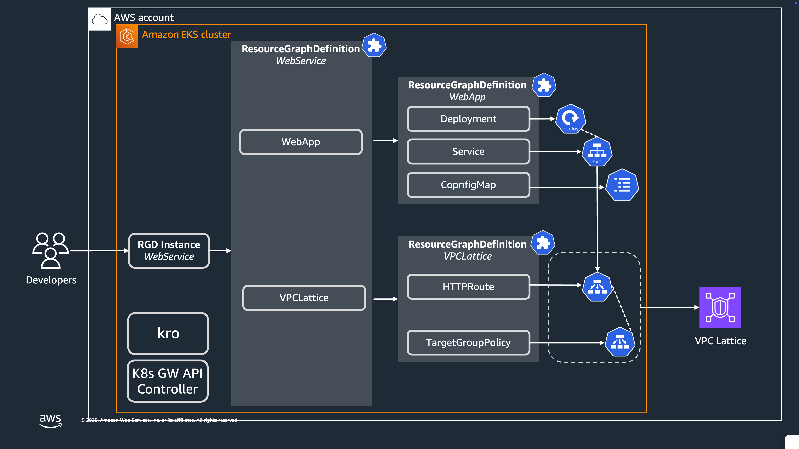

# KRO VPC Lattice Demo

This example demonstrates how to use KRO (Kubernetes Resource Orchestrator) to deploy and manage Amazon VPC Lattice resources on an Amazon EKS cluster, providing a streamlined approach to service networking in Kubernetes.

## Overview

Amazon VPC Lattice is a fully managed application networking service that enables you to connect, secure, and monitor all your services across multiple accounts and virtual private clouds (VPCs). This demo shows how to:

1. Use KRO to define reusable resource graphs for VPC Lattice integration
2. Implement Kubernetes Gateway API with the AWS Gateway Controller
3. Deploy applications with simplified networking configuration
4. Connect Kubernetes services to the VPC Lattice service network




## Prerequisites

- Amazon EKS cluster
- AWS CLI configured with appropriate permissions
- kubectl installed and configured
- Helm v3
- jq

## Installation

### 1. Install KRO

KRO (Kubernetes Resource Orchestrator) provides a way to define, deploy and manage complex Kubernetes resources as reusable templates.

```bash
export KRO_VERSION=$(curl -sL \
    https://api.github.com/repos/kro-run/kro/releases/latest | \
    jq -r '.tag_name | ltrimstr("v")'
  )
helm install kro oci://ghcr.io/kro-run/kro/kro \
  --namespace kro \
  --create-namespace \
  --version=${KRO_VERSION}
```

### 2. Install Kubernetes Gateway API and AWS Gateway API Controller

This step installs the Kubernetes Gateway API CRDs and the AWS Gateway API Controller for Amazon VPC Lattice integration.

First, configure the necessary security group rules to allow VPC Lattice to communicate with your EKS cluster:

```bash
# Set environment variables
export AWS_REGION=<your-aws-region>
export EKS_CLUSTER_NAME=<your-eks-cluster-name>
export LATTICE_IAM_ROLE=<your-lattice-iam-role-arn>

# Configure security group rules
CLUSTER_SG=$(aws eks describe-cluster --name $EKS_CLUSTER_NAME --output json| jq -r '.cluster.resourcesVpcConfig.clusterSecurityGroupId')
PREFIX_LIST_ID=$(aws ec2 describe-managed-prefix-lists --query "PrefixLists[?PrefixListName=='com.amazonaws.$AWS_REGION.vpc-lattice'].PrefixListId" | jq -r '.[]')
aws ec2 authorize-security-group-ingress --group-id $CLUSTER_SG --ip-permissions "PrefixListIds=[{PrefixListId=${PREFIX_LIST_ID}}],IpProtocol=-1"
PREFIX_LIST_ID_IPV6=$(aws ec2 describe-managed-prefix-lists --query "PrefixLists[?PrefixListName=='com.amazonaws.$AWS_REGION.ipv6.vpc-lattice'].PrefixListId" | jq -r '.[]')
aws ec2 authorize-security-group-ingress --group-id $CLUSTER_SG --ip-permissions "PrefixListIds=[{PrefixListId=${PREFIX_LIST_ID_IPV6}}],IpProtocol=-1"
```

Next, install the Kubernetes Gateway API and AWS Gateway Controller:

```bash
# Install Kubernetes Gateway API CRDs
kubectl apply -f https://github.com/kubernetes-sigs/gateway-api/releases/download/v1.2.0/standard-install.yaml

# Log in to AWS ECR public registry
aws ecr-public get-login-password --region us-east-1 \
  | helm registry login --username AWS --password-stdin public.ecr.aws

# Get latest controller version
LATTICE_CONTROLLER_VERSION=$(curl -sL \
    https://api.github.com/repos/aws/aws-application-networking-k8s/releases/latest | \
    jq -r '.tag_name | ltrimstr("v")'
  )

# Install AWS Gateway Controller
helm install gateway-api-controller \
    oci://public.ecr.aws/aws-application-networking-k8s/aws-gateway-controller-chart \
    --version=v${LATTICE_CONTROLLER_VERSION} \
    --create-namespace \
    --set=aws.region=${AWS_REGION} \
    --set serviceAccount.annotations."eks\.amazonaws\.com/role-arn"="$LATTICE_IAM_ROLE" \
    --set=defaultServiceNetwork=kro-vpc-lattice-demo \
    --namespace gateway-api-controller \
    --wait
```

### Deploy gatewayClass and gateway resources 
```
kubectl apply -f resources/gatewayclass.yaml
kubectl apply -f resources/gateway.yaml
```


## Resource Graph Definitions

### 3. Deploy the Lattice Resource Graph Definition

Create a Lattice Resource Graph Definition that maps VPC Lattice components to Kubernetes resources:

```bash
kubectl apply -f rg-lattice.yaml
```

The `rg-lattice.yaml` defines how to translate a simple schema into VPC Lattice-related Kubernetes Gateway API resources, including TargetGroupPolicy, and HTTPRoute.

### 4. Deploy the WebApp Resource Graph Definition

Create a WebApp Resource Graph Definition to simplify application deployment:

```bash
kubectl apply -f rg-webapp.yaml
```

The `rg-webapp.yaml` defines a template for deploying a web application with a Kubernetes Deployment and Service.

### 5. Deploy the WebService Resource Graph Definition

Create a WebService Resource Graph Definition that combines the WebApp and Lattice resources:

```bash
kubectl apply -f rg-webservice.yaml
```

The `rg-webservice.yaml` combines the WebApp and Lattice resource graphs, allowing you to deploy a web service with optional VPC Lattice integration.

## Deploying Your Application

### 6. Deploy Your Application Instance

Create an instance of the WebService with VPC Lattice integration enabled:

```bash
kubectl apply -f instance.yaml
```

## Architecture

This project implements a three-layer architecture:

1. **Base Resources Layer**: Core Kubernetes resources (TargetGroupPolicy, HTTPRoute, Deployment, Service)
2. **Resource Graph Layer**: Reusable templates (Lattice, WebApp, WebService) that abstract the base resources
3. **Instance Layer**: Application-specific instances created from the resource graphs

## Accessing Your Service

Once deployed, your service will be accessible through the VPC Lattice service network. You can find the VPC Lattice endpoint using the AWS Console or the following AWS CLI command:

```bash
aws vpc-lattice list-service-networks
aws vpc-lattice list-services --service-network-identifier kro-vpc-lattice-demo
```

## Benefits of This Approach

- **Simplified Configuration**: Reduce complexity by abstracting away the detailed configuration of VPC Lattice resources
- **Reusable Templates**: Create standardized deployment patterns that can be reused across multiple applications
- **Declarative Approach**: Define the desired state of your infrastructure and application components
- **Improved Developer Experience**: Allow developers to deploy applications with VPC Lattice integration without deep networking knowledge

## Troubleshooting

- Ensure your EKS cluster has the required IAM permissions for VPC Lattice integration
- Verify the security group rules are correctly configured to allow VPC Lattice traffic
- Check the Gateway API Controller logs for any errors:
  ```bash
  kubectl logs -n gateway-api-controller -l app.kubernetes.io/name=gateway-api-controller
  ```
