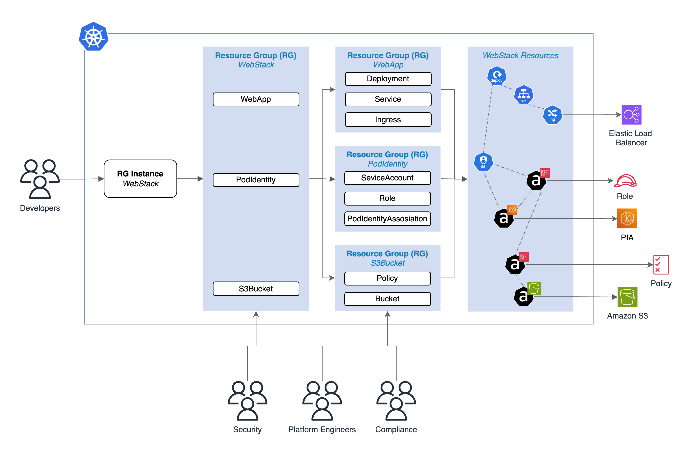

# kro Nested RG example

This example creates a ResourceGraphDefinition called `WebStack` comprised of
three other RGs: `WebApp`, `S3Bucket`, and `PodIdentity`


_Figure 1: Nested RGD Example_

### Create ResourceGraphDefinitions

Change directory to `examples`:

```
cd examples/
```

Apply the RGs to your cluster:

```
kubectl apply -f aws/podidenity/rg.yaml -f aws/s3bucket/rg.yaml -f kubernetes/webapp/rg.yaml
kubectl apply -f aws/webstack/rg.yaml
```

Validate the RGs statuses are Active:

```
kubectl get rgd
```

Expected result:

```
NAME                  APIVERSION   KIND          STATE    AGE
podidentity.kro.run   v1alpha1     PodIdentity   Active    7m
s3bucket.kro.run      v1alpha1     S3Bucket      Active    7m
webapp.kro.run        v1alpha1     WebApp        Active    7m
webstack.kro.run      v1alpha1     WebStack      Active    7m
```

### Create an Instance of kind WebStack

Create an environment variable with uniquie name, that will be the name of your S3 Bucket.

```
export RESOURCES_NAME=<test-app-11223344-replace-me-with-random-string>
```

Validate the variable populated:

```
echo $RESOURCES_NAME
```

Expected result:

```
<test-app-11223344-my-random-string>
```

Run the following command to replace the `$RESOURCES_NAME` variable in `instance-tmpl.yaml` file and create
a new file called instance.yaml.

```shell
envsubst < "webstack/instance-tmpl.yaml" > "webstack/instance.yaml"
```

Apply the `webstack/instance.yaml`

```
kubectl apply -f webstack/instance.yaml
```

Validate instance status:

```
kubectl get webstacks test-app
```

Expected result:

```
NAME       STATE    SYNCED   AGE
test-app   ACTIVE   True     16m
```

### Validate the app is working

Get the URL:

```
echo "http://$(kubectl get webstack test-app -o jsonpath='{.status.url}')"
```

Either navigate in the browser at `/health` or curl it:

```
curl -s http://$(kubectl get webstack test-app -o jsonpath='{.status.url}')/health
```

Expected result:

```
{
  "message": "Application is running and can connect to S3",
  "status": "healthy"
}
```

### Troubleshoot

If you get the folling error:

```
Error connecting to S3:...
```

Try restarting the pod.

### Clean up

Remove the instance:

```
kubectl delete webstacks test-app
```

Remove the ResourceGraphDefinitions:

```
kubectl delete rgd webstack.kro.run webapp.kro.run s3bucket.kro.run podidentity.kro.run
```
