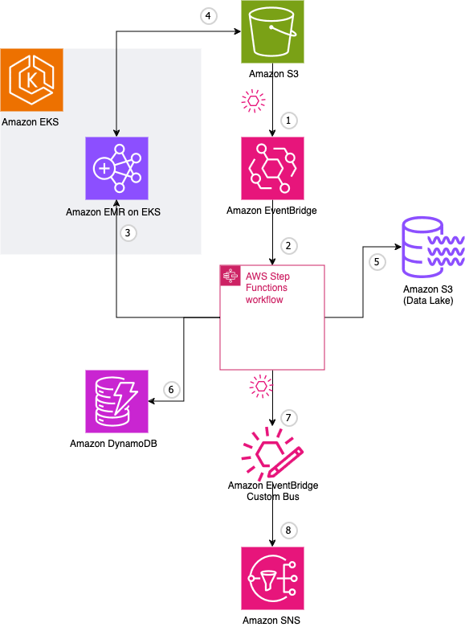

# Event Driven Architectures with Amazon EKS and AWS Controllers for Kubernetes

This data processing example uses event-driven approach for data ingestion and process orchestration, along with Amazon EMR on EKS for data processing implementation. This example uses [New York City taxi data](https://www.nyc.gov/site/tlc/about/tlc-trip-record-data.page).
## Architecture

Following diagram illustrates flow of the example and services used:


1. Once data object lands into input bucket on Amazon S3, it sends event to the Amazon EventBridge
2. EventBridge, based on a rule, starts AWS Step Functions workflow execution that orchestrates data processing
3. Workflow creates EMR on EKS virtual cluster and starts Apache Spark job, specifying script in an S3 bucket to be used and data object in the S3 to be processed
4. Spark job reads the newly arrived data from S3, runs the processing, and saves output data to a S3 bucket.
5. In parallel to the data processing by Spark, Step Functions workflow copies incoming data file to a data lake (another S3 bucket) 
6. Once Spark finishes data processing, workflow reads results from the S3 bucket and puts them to an Amazon DynamoDB database
7. Workflow sends event to the EventBridge custom bus, notifying all subscribers that data processing task finished 
8. Amazon Simple Notification Service (SNS) receives event from the event bus and sends e-mail message to the subscribers

Following diagram shows Step Functions workflow:


## Prerequisites
EKS cluster with EMR on EKS deployed and IRSA configured. Following steps are based on [AWS ACK tutorial instructions](https://aws-controllers-k8s.github.io/community/docs/tutorials/emr-on-eks-example/)

Install kro in the cluster created in the previous step following [instructions](https://kro.run/docs/getting-started/Installation)

## Create instance

Create kro ResourceGroup for the data processor:
```shell
kubectl apply -f eda-eks-data-processor.yaml
```

Create instance of the data processor

Set workload name (it will be used as a prefix for the stack components):
```shell
export WORKLOAD_NAME="eda-eks-demo"
```

Following steps assume that input, scripts and data lake buckets are the same one. Resource group creates a new input bucket only. If you use the same name for scripts and lake, it will use input bucket for all purposes. Specify different bucket name for the scripts library and data lake if necessary.

```shell
export INPUT_BUCKET_NAME="${WORKLOAD_NAME}-bucket"
export SCRIPTS_BUCKET_NAME="${WORKLOAD_NAME}-bucket"
export LAKE_BUCKET_NAME="${WORKLOAD_NAME}-bucket"
```

```shell
envsubst < "instance-template.yaml" > "instance.yaml"
```
Check that the instance definition populated with values. Update prefix, API name or description values in the definition if desired.
```shell
cat instance.yaml
```

## Deploy instance

Apply the instance definition:
```shell
kubectl apply -f instance.yaml
```


## Post-deployment steps
### S3 event notification configuration update
Check newly created bucket name:
```shell
export BUCKET_NAME=$(kubectl get bucket.s3.services.k8s.aws -o jsonpath='{.items..metadata.name}' --namespace $WORKLOAD_NAME | grep $WORKLOAD_NAME)
```
This step is required until ACK missing feature is implemented. 
```bash
# Enable EventBridge notifications as ACK does not support it at this time and they are not enabled by default
aws s3api put-bucket-notification-configuration --bucket $BUCKET_NAME --notification-configuration='{ "EventBridgeConfiguration": {} }'
```
### Spark data processing script upload
```bash
aws s3 cp ./scripts s3://$BUCKET_NAME/scripts --recursive
```

## Test

List all resources in the stack namespace (it will take some time to get all results):
```shell
kubectl api-resources --verbs=list --namespaced -o name | xargs -n 1 kubectl get --show-kind --ignore-not-found -n $WORKLOAD_NAME
```
Copy sample data for processing (for example `yellow_tripdata_2024-05.parquet`):
```shell
aws s3 cp <your-sample-data-file-folder>/yellow_tripdata_2024-05.parquet s3://$BUCKET_NAME/input/yellow_tripdata_2024-05.parquet
```

## Clean up

Delete S3 bucket content:
```shell
aws s3 rm --recursive s3://$BUCKET_NAME
```
Delete instance and resource group:
```shell
kubectl delete -f instance.yaml
kubectl delete -f eda-eks-data-processor.yaml
```

Note: You may need to patch resource finalizer in case deletion of the resource hangs. For example, following command patches SNS subscription in `eda-eks-demo` namespace (unconfirmed subscriptions cannot be deleted (they are cleaned up automatically after 48hrs) and prevent resource from deletion):
```shell
kubectl patch subscription.sns.services.k8s.aws/eda-eks-demo-notifications-subscription -p '{"metadata":{"finalizers":[]}}' --type=merge --namespace eda-eks-demo
```

