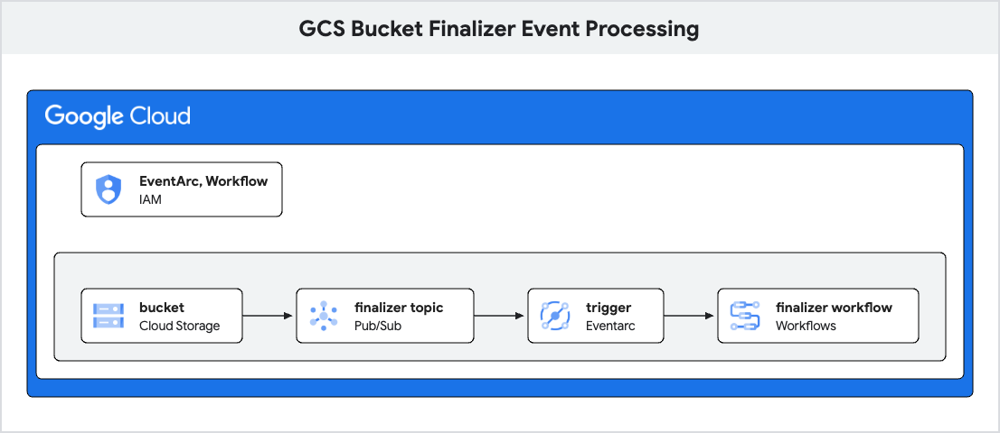

# GCSBucketWithFinalizerTrigger

A **Platform Administrator** wants to give end users in their organization self-service access to creating GCS Buckets that triggers a Cloud Workflow when any object in it is finalized. The platform administrator creates a kro ResourceGraphDefinition called *gcsbucketwithfinalizertrigger.kro.run* that defines the required Kubernetes resources and a CRD called *GCSBucketWithFinalizertrigger* that exposes only the options they want to be configurable by end users.

The following KCC objects are created by this RGD:
* IAMServiceAccount, IAMPolicyMember: Service Account with necessary permissions for Eventarc and Pub/Sub.
* StorageBucket
* PubSubTopic
* EventArcTrigger
* StorageNotification: To publish events from the GCS bucket to a Pub/Sub topic.

Pre-requisites:
* Workflow: The workflow to be triggered on Finalizer event.

Everything related to these resources would be hidden from the end user, simplifying their experience.  



<!--
meta {
  title "GCS Bucket Finalizer Event Processing"
}

elements {
  gcp {
      card iam {
         name "EventArc, Workflow"
      }
      group  storageA {
        name ""
        card gcs {
        name "bucket"
        }
        card pubsub {
        name "finalizer topic"
        }
        card eventarc {
        name "trigger"
        }
        card workflows {
        name "finalizer workflow"
        }
      }
  }
}

paths {
  gcs \-\-> pubsub
  pubsub \-\-> eventarc
  eventarc \-\-> workflows
}
-->


## End User: GCSBucketWithFinalizerTrigger

The administrator needs to install the RGD first.
The end user creates a `GCSBucketWithFinalizerTrigger` resource something like this:

```yaml
apiVersion: kro.run/v1alpha1
kind: GCSBucketWithFinalizerTrigger
metadata:
  name: gcsevent-test
  namespace: config-connector
spec:
  name: demo-gcs               # used as name or prefix for KCC objects
  workflowName: gcs-finalizer-workflow   # Replace with your workflow path
  location: us-central1        # desired location
  project: my-project-name     # Replace with your project name
```

They can then check the status of the applied resource:

```
kubectl get gcsbucketwithfinalizertrigger -n config-connector
kubectl get gcsbucketwithfinalizertrigger gcsevent-test -n config-connector -o yaml
```

Navigate to GCS page in the GCP Console and verify the bucket creation. Also verify that the Triggers are setup correctly in the EventArc page.

Once done, the user can delete the `GCSBucketWithFinalizerTrigger` instance:

```
kubectl delete gcsbucketwithfinalizertrigger gcsevent-test -n config-connector
```

## Administrator: ResourceGraphDefinition
The administrator needs to install the RGD in the cluster first before the user can consume it:

```
kubectl apply -f rgd.yaml
```

Validate the RGD is installed correctly:

```
kubectl get rgd gcsbucketwithfinalizertrigger.kro.run
```

Once all user created instances are deleted, the administrator can choose to deleted the RGD.
