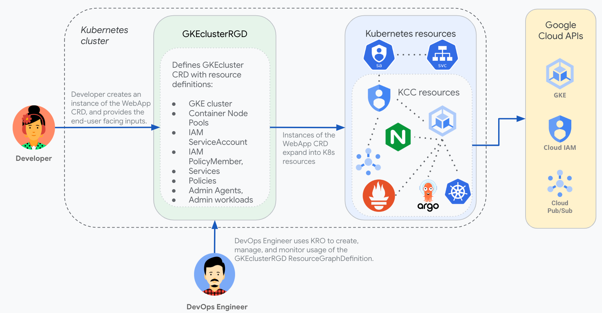

# GKE cluster definition

A **Platform Administrator** wants to give end users in their organization self-service access to create GKE clusters. The platform administrator creates a kro ResourceGraphDefinition called *gkecluster.kro.run* that defines the required Kubernetes resources and a CRD called *GKEcluster* that exposes only the options they want to be configurable by end users. The ResourceGraphDefinition would define the following resources (using [KCC](https://github.com/GoogleCloudPlatform/k8s-config-connector) to provide the mappings from K8s CRDs to Google Cloud APIs):

* GKE cluster
* Container Node Pool
* Network
* Subnetwork
* KMSKeyRing   - Encrypt BootDisk
* KMSCryptoKey - Encrypt BootDisk

The platform administrator would define the schema for `GKECluster` CRD which the end user creates:
* name: same for all GCP resources created
* location: region to be used for the GCP resources
* maxnodes: Max scaling limit for the nodes in the node pool

Everything related to these resources would be hidden from the end user, simplifying their experience.  




# GKECluster example

This example creates a ResourceGraphDefinition called `GKECluster` to deploy a GKE cluster.

## Create ResourceGraphDefinitions

Apply the RGD to your cluster:

```
kubectl apply -f rg.yaml
```

Validate the RG:

```
kubectl get rg
```

## Create an Instance of CloudSQL
Set the env variables used in the instance template:
```
export CLUSTER_NAME=krodemo
export GCP_REGION=us-central1
export MAX_NODES=4
```

Run the following command to replace the env variables in `instance-template.yaml` file and create
a new file called instance.yaml. 
```shell
envsubst < "instance-template.yaml" > "instance.yaml"
```

Apply the `instance.yaml` 

```
kubectl apply -f instance.yaml
```

Validate instance status:

```
kubectl get gkeclusters
```

## Validate

Navigate to GKE Cluster page in the GCP Console and verify the cluster.

## Clean up

Remove the instance:

```
kubectl delete gkecluster $CLUSTER_NAME
```

Remove the ResourceGraphDefinitions:

```
kubectl delete rgd gkecluster.kro.run
```
