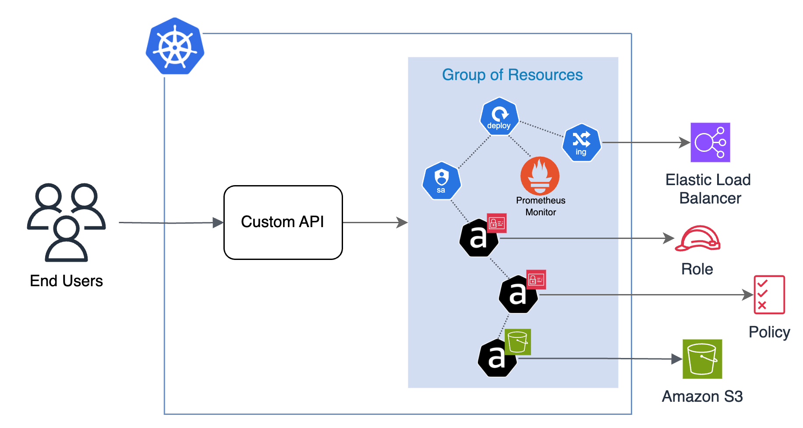
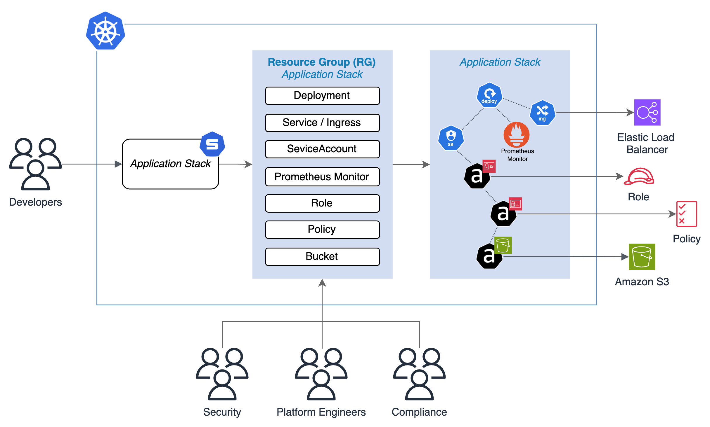
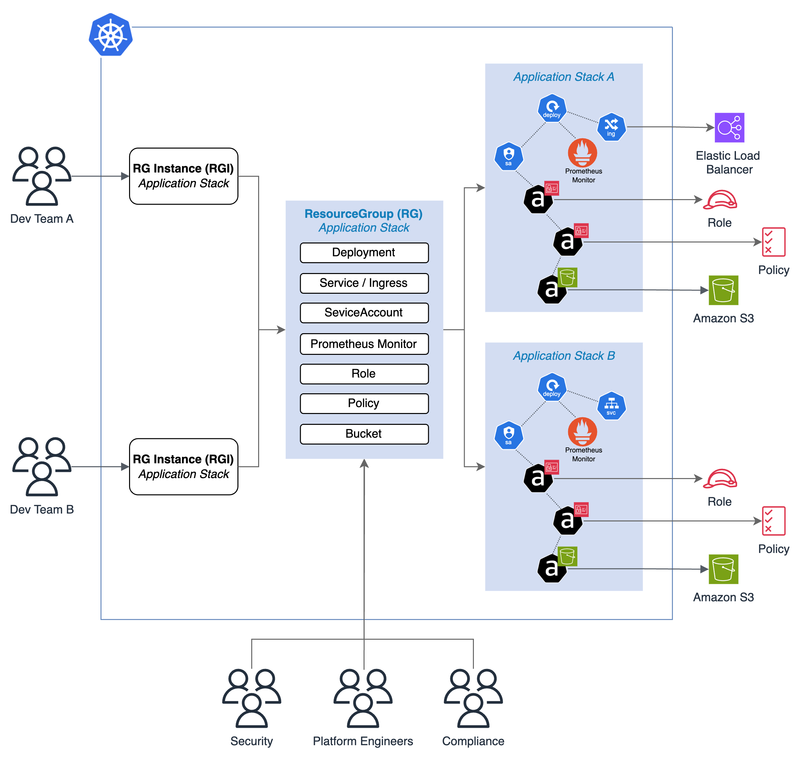

# What is kro?

**kro** (Kube Resource Orchestrator) is an open-source, Kubernetes-native project
that allows you to define custom **Kubernetes APIs** using simple and straightforward
configuration. With kro, you can easily configure new custom APIs that create a
group of Kubernetes objects and the logical operations between them. kro leverages
[CEL (Common Expression Language)](https://github.com/google/cel-spec), the same
language used by Kubernetes webhooks, for logical operations. Using CEL expressions,
you can easily pass values from one object to another and incorporate conditionals into
your custom API definitions. Based on the CEL expressions, kro automatically calculates
the order in which objects should be created. You can define default values for fields
in the API specification, streamlining the process for end users who can then
effortlessly invoke these custom APIs to create grouped resources.

# How does kro work?

### Developer interface

When the end user applies a YAML spec to the cluster using the **Custom API**,
the API creates a set of resources within the cluster. These resources can
include both **native Kubernetes** resources and any **Custom Resource
Definitions (CRDs)** installed in the cluster. Some of these resources may
create additional resources outside of your cluster.

As depicted in the following diagram, the Developers call the Custom API, which
creates resources such as the **Deployment**, **Ingress**, **ServiceAccount**,
**Prometheus Monitor**, **IAM Role**, **IAM Policy**, and **Amazon S3 Bucket**.
This allows the Developers to easily manage and deploy their applications in a
standardized and streamlined manner.

_Fugure 1: End user interface - Custom API_

### ResourceGraphDefinition

When you install **Kro** in your cluster, it installs a Custom Resource
Definition (CRD) called **ResourceGraphDefinition (RG)**. The **Platform**, **Security**,
and **Compliance** teams can collaborate to create custom APIs by defining
Custom Resources for the ResourceGraphDefinition CRD.

In the depicted example, the **Platform Team** has created a **RG** with
arbitrary name "Application Stack" that encapsulates the necessary resources,
along with any additional logic, abstractions, and security best practices. When
the RGD is applied to the cluster, a new API of kind ApplicationStack is created
and available for Developer to interact with. The Developers no longer need to
directly manage the underlying infrastructure complexities, as the custom API
handles the deployment and configuration of the required resources.

_Fugure 2: ResourceGraphDefinition (RG) - Platform Team Interface_

### ResourceGraphDefinition Instance

Developer teams can create multiple instances of the **Application Stack**, each
tailored to their specific requirements. As shown, **Dev Team A** and **Dev Team
B** have both instantiated their own Application Stacks. While the underlying
resources are similar, **Dev Team A** has chosen to expose their service
externally, leveraging the Ingress option, while **Dev Team B** has opted to
keep their service internal to the cluster. This flexibility allows each
development team to customize their application stack based on their specific
requirements.

_Fugure 3: ResourceGraphDefinition Instance (RGI)_

# Why kro?

### Manage any group of resources as one unit

Using **kro**, the **Platform Team** can enable Developer teams to quickly
deploy and manage applications and their dependencies as one unit, handling the
entire lifecycle from deployment to maintenance. The new APIs integrate
seamlessly with developers' existing CD tools, preserving familiar processes and
interfaces to simplify adoption.

### Collaborate

Transform **Kubernetes** into your unified platform configuration framework
using **kro**. Platform, Compliance, and Security teams work together to develop
APIs that standardize and streamline configurations, making it easier for
Developer teams to adopt secure, compliant practices. This collaboration lets
you build your organizational standards directly into the APIs, ensuring every
application deployment aligns with security and compliance requirements without
adding complexity for developers.

### Standardize

By creating unified APIs, you can define and enforce best practices across all
environments, ensuring every application meets organizational requirements and
achieving consistency across deployment environments.

# Community

We welcome questions, suggestions, and contributions from the community! To get
involved, check out our
[contributing guide](https://github.com/kro-run/kro/blob/main/CONTRIBUTING.md).
For bugs or feature requests, feel free to
[submit an issue](https://github.com/kro-run/kro/issues). You’re also invited to
join our
[community](https://github.com/kro-run/kro?tab=readme-ov-file#community-participation).
